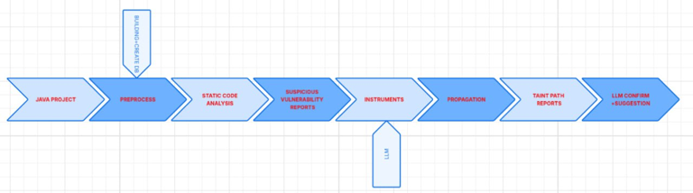

# HybridTaintLLM

## 👋 Overview

HybridTaintLLM is a framework that combines static analysis, dynamic analysis, and LLM to detect security vulnerabilities based on taint flow analysis. HybridTaintLLM uses LLM to support tagging for the dynamic analysis module to determine whether the alerts from static analysis are correct or not. At a high level, Hybird takes the OWASP project and CWEs (vulnerability classes, such as traversal vulnerabilities or CWE-22) as input, statically analyzes the project, derives a set of potential vulnerabilities (CWE types) in the project, feeds it into dynamic analysis to support alert identification, and then outputs results, eliminating false alerts.



## 🚀 Set Up
### Native (Mac/ Linux)
#### Step 1: Setup environment & Dataset
Install nesscessary library:
```shell
pip3 install -r requirements.txt
```

Clone Dataset OWASP:
```sh
git clone https://github.com/OWASP-Benchmark/BenchmarkJava.git
```
#### Step 2: Configure CodeQL
HybridTaintLLM relies on the CodeQL Action bundle, which includes CLI utilities and pre-defined queries for various CWEs and languages ("QL packs").

If you already have CodeQL installed, specify its location via the `CODEQL_DIR` environment variable in `directory.py`. Otherwise, download an appropriate version of the CodeQL Action bundle from the [CodeQL Action releases page](https://github.com/github/codeql-action/releases).

For new devices, the script `codeql_install.py` can be used to install:
```shell
# Install CodeQL
python3 SAST_Module/script/codeql_install.py

# Build Database for CodeQL
python3 SAST_Module/script/codeql_create_db.py
```

#### Step 3: Configure Galette
HybridTaintLLM is based on the Galette package, which includes CLI utilities for instrumenting the JDK and related resources, tagging and tag propagation. It can be downloaded from the [Galette repository pages](https://github.com/neu-se/galette).

Note that the Galette directory path is located at `GALETTE_DIR` in `directory.py`.

You can use the `galette_install.py` script to install Galette and perform related tasks including:
- Install Galette
- Build Galette with Maven
- Install OpenJDK17U-jdk_x64_linux_hotspot_17.0.11_9
- Instrument JDK
```shell
python3 /DAST_Module/script/galette_install.py
```

#### Step 4: Configure key of LLM Model
For the model to work, you need to have the API_KEY of the Gemini_2.5_Flash model. The key will be stored in `GEMINI_KEY` in `LLM_secret.py`

## ⚡ Quickstart
Make sure you have followed all of the environment setup instructions before proceeding!

To quickly try HybridTaintLLM on the example `CWE_demo`, run the following commands:

```shell
# with no using explicit cache in tagging
python3 script/run_all_thing.py --cwe demo --model Gemini-2.5_flash --nocache 

# with using explicit cache in tagging, cache is available with Gemini model
python3 script/run_all_thing.py --cwe demo --model Gemini-2.5_flash --nocache
```
This will build the project, generate the CodeQL database, and analyze it for CWE-022 vulnerabilities using the specified LLM (Gemini_2.5_Flash). The output of these three steps will be stored under `SAST_Module/ql_results`, `DAST_Module/galette_result`, and `LLM/result` respectively.

## 💫 Handstart 
Verify that all setup steps have been completed prior to proceeding.

Example The instruction will be run with `CWE_022`, run the following commands:
```shell
# Query the database
python3 SAST_Module/script/codeql_run_query.py --cwe 22

# Generate prompt for tagging
python3 DAST_Module/script/galette_gen_user_prompt.py --cwe 22

## Tagging with LLM no cache
python3 DAST_Module/script/galette_LLM_instrument_no_cache.py --cwe 22 --model Gemini-2.5_flash

## Tagging with LLM with cache
python3 DAST_Module/script/galette_LLM_instrument_cache.py --cwe 22 --model Gemini-2.5_flash

# Overwrite output LLM to Dataset
python3 DAST_Module/script/galette_tagging_overwrite.py --cwe 22

# Propagation tags
python3 DAST_Module/script/galette_propagation.py --cwe 22

# Generate prompt for trigger alerts
python3 LLM/script/generate_user_prompt.py --cwe 22

# Trigger alerts with LLM
python3 LLM/script/LLM_trigger_alert.py --cwe 22 --model Gemini-2.5_flash
```
Our models besides `Gemini-2.5-flash` can also still run with `ollama-deepseek-8b-q4`, `ollama-deepseek-1.5b-q4`, `ollama-qwen-1.7b`, `ollama-qwen-8b`, `ollama-gpt-oss`

## 🤝 Our Team
HybridTaintLLM is a product of the Information Assurance Capstone Project of FPT University. Please contact us if you have any questions about HybridTaintLLM.